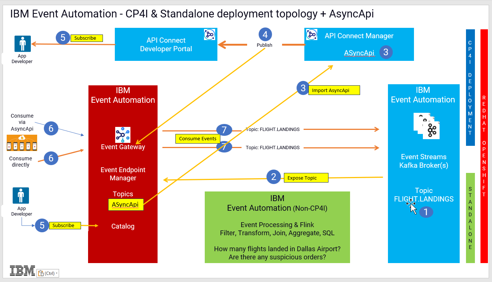

## Multi-Style Integration with IBM Cloud Pak for Integration Event Endpoint Experience

Get hands on building API and Event driven flows in this day in the life experience integrating with Async APIs

[Return to main APIC lab page](../README.md#lab-abstracts)

# IBM Cloud Pak for Integration - IBM API Connect AsyncAPI Labs

AsyncApi's helps you to socialize the Kafka sources (Topics) as API's through IBM API Connect and IBM Event Gateway. The labs will enable Cloud Pak for Integration users on how to obtain an Async API from IBM Event Endpoint Manager, import, manage and publish it with IBM API Connect, and finally consume the events connecting to the event gateway using open-source kafka client kafka-console-consumer.sh as well as consuming from a Java Client Application.

**Architecture Diagram below**

## Lab Abstracts

|  Subject                            | Description                                            |                                                               
|-------------------------|------------------------------------------------------------------------------------------------------------|
| [Lab 1](lab1/ReadMe.md)       | In this lab you will:  a) Review Kafka Topics that are managed in the Event Endpoint Manager b) Select the ``FLIGHT.LANDINGS`` topic and export as AsyncAPI for IBM API Connect Management. c) Import the AsyncAPI that you exported from the EEM portal. c) Create a new Product for the AsyncAPI and Publish the Product & AsyncApi to API Connect Developer Portal and IBM Event Gateway.
|-------------------------|------------------------------------------------------------------------------------------------------------|
| [Lab 2](lab2/ReadMe.md)       | In this lab you will:  a) Subscribe to the AsyncApi from API Connect Developer Portal.  b) Then you will get code samples from API Connect Developer Portal to use to run Kafka clients to consume the Flight landing events being produced to the ``FLIGHT.LANDINGS`` topic.
|-------------------------|------------------------------------------------------------------------------------------------------------|
| [Lab 3](lab3/ReadMe.md)       |In this lab you will, obtain the Event Gateway Bootstrap certificates and then you will test consuming Flight Landing Events with the *kafka_console* tool and with a custom Java app.

[Return to main APIC lab page](../README.md#lab-abstracts)
