# AsyncApi - As Developer Discover and Subscribe to Flight Landing AsyncAPI

In this lab, you will switch roles and now you will be a developer and sign in to the Developer Portal to discover APIs, including AsyncAPIs, that have been published from APIC.

In this lab, you will explore the following key capabilities:

-    Access the Developer Portal and browse AsyncAPIs

-    Create an application and subscribe to a Plan to consume the AsyncAPI

 

[Return to main EEM lab page](../index.md#lab-abstracts)

### 1.0 Login to the API Connect Developer Portal

A Developer Portal for the Sandbox catalog has already been configured in this environment.

If you are already logged into APIC UI please go to step 4, or even if you are already logged into APIC Dev Portal in another tab please switch to that tab and go to step 10.

1. If you are not already logged into the Platform Navigator, enter the URL for the Platform Navigator that was provided by your instructor and use your credentials to log in.  To navigate to the main page of the Platform Navigator, click on **Integration instances**.

    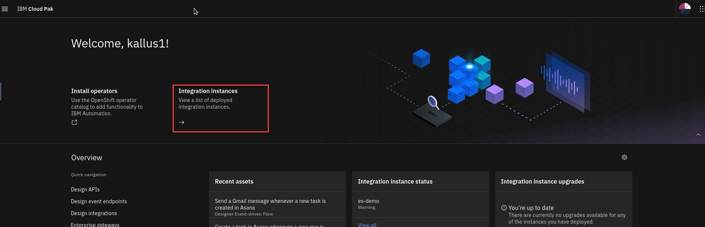

1. Navigate to the API Connect instance.

    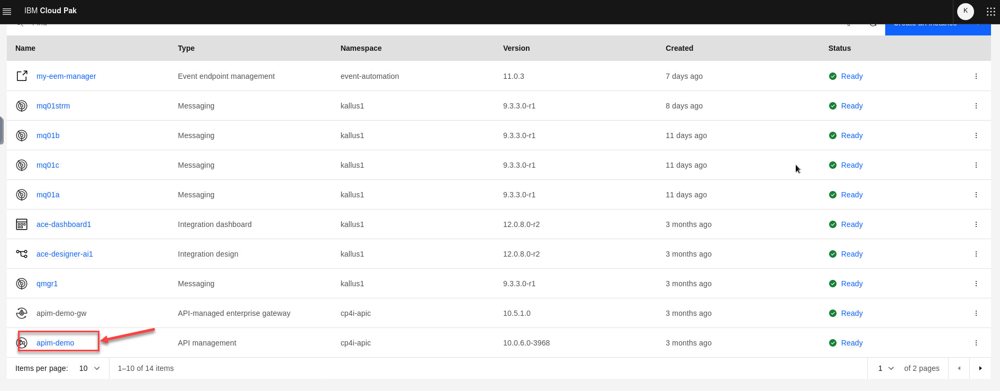

1. If this is your first time logging in, the login page is presented. Click **Common Services User Registry**.

    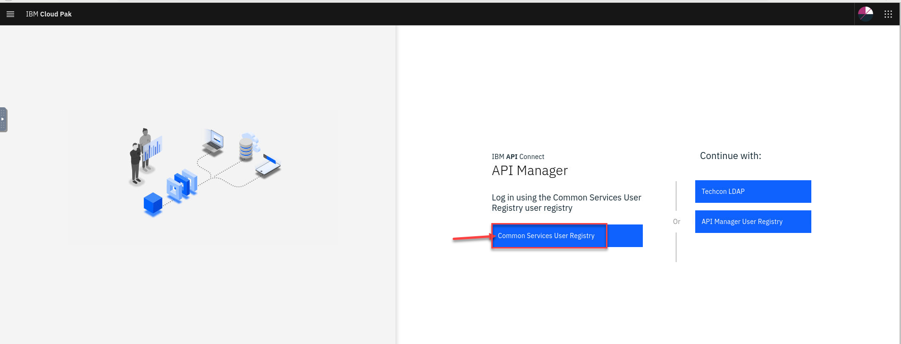  

1. Now from the APIC Home page select the **Manage catalogs** tile or icon on the left side of the page.

    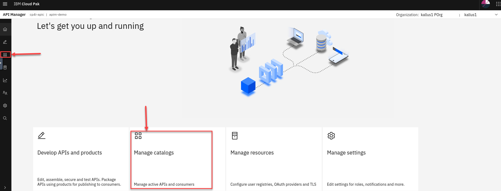

1. We only have the default Sandbox catalog setup up so Click on **Sandbox**.

    **NOTE:** This is where you could have several catalogs for other environments.

    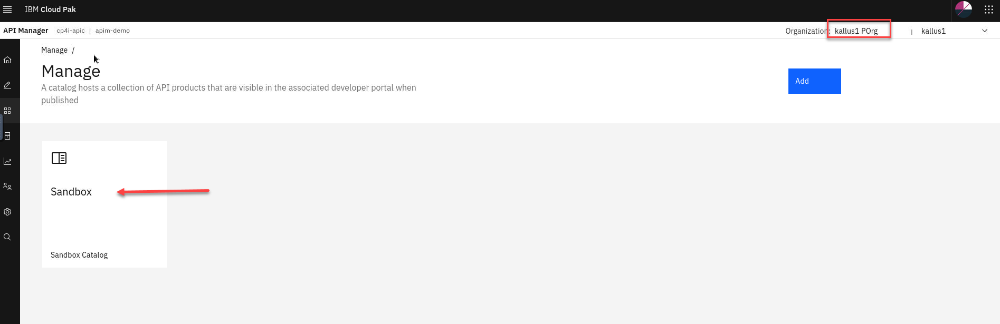

1. Select the **Catalog settings** tab.

    **Note:** Depending on how many labs you have completed, your Products list may differ then what is reflected in the screenshot.

    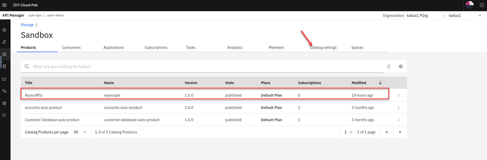

1. From the left menu, click on **Portal**.

    You will see the portal details.   Highlight the **Portal URL** and right click to open URL in new tab or paste it in a new browser tab.  
    **Note:** If you get a warning message that your connection is not private go ahead and accept the exception.

    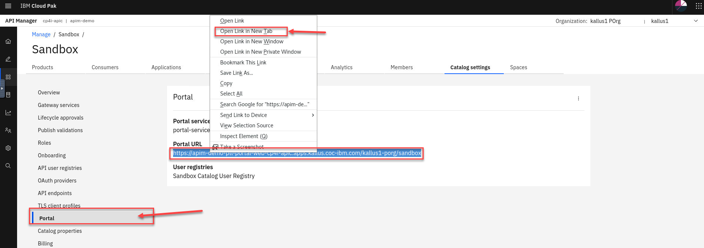

1. You should now be on the Portal page.

    Click on **Sign In** in the upper right corner of the page.

    A Portal Administrator can customize the look and feel to their organizational specifications. The default Developer Portal looks like the image below.  

    **Note:**  Depending on what you have published, the Products that you see may be different.

    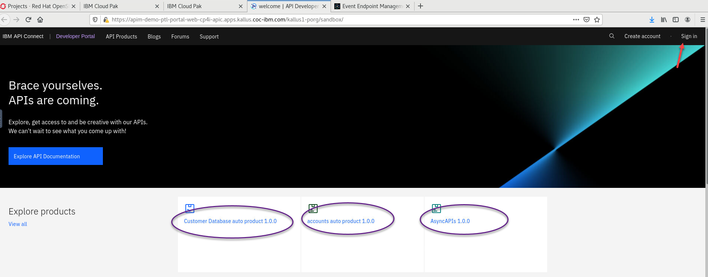

1.  The IBM API Connect Developer Portal provides consumers access to API Catalog information.  This gives application developers the opportunity to explore and test APIs, register applications, and subscribe to Plans. This can be managed by the administrator or you can provide self service.

    For the lab each student will be provided with Consumer credentials similar to your student id.  Sign in to the portal.

    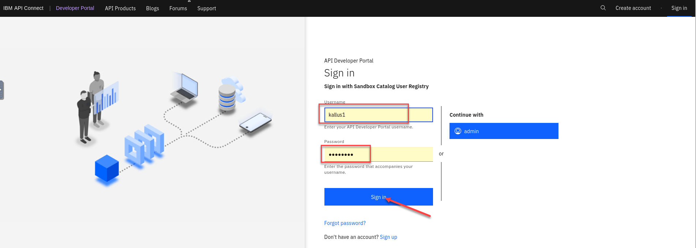

1. You should now show that you are sign in in the upper right corner.   First thing we will do is create an App for testing the AsyncAPIs.

    Click on the **Apps** menu

    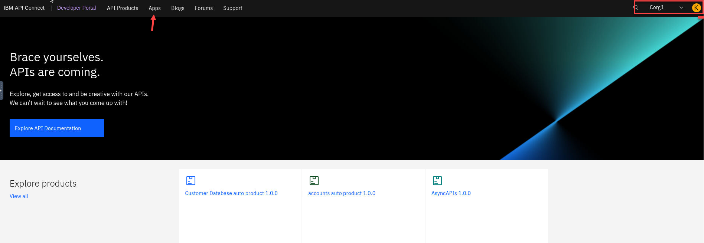

1. We will now create a new App for consuming the AsyncAPI and to receive event from the corresponding Kafka topic.

    Click on **Create new app**

    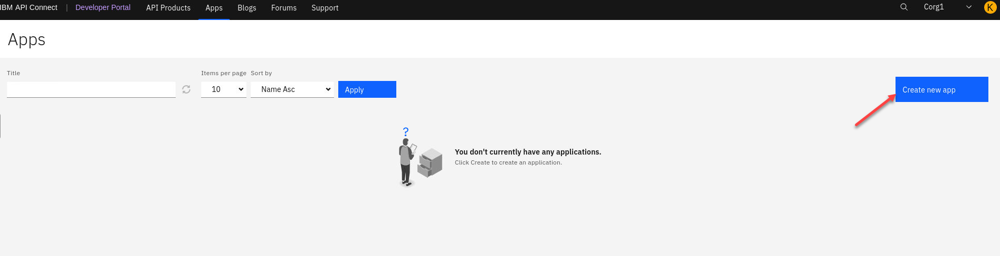

1. Now give a name to the new App,  something like **flight-landing**

    You can also add a description like *Consuming Flight landing messages*. Click **Save**

    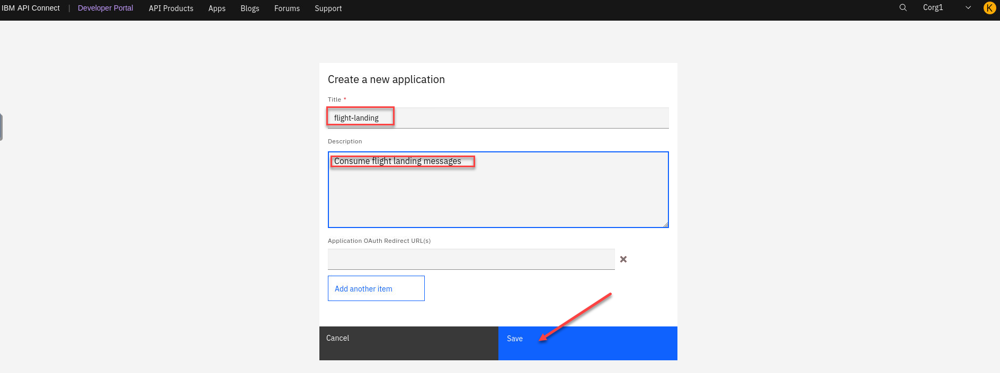

1. A window will pop up saying the *Application created successully*

    **Important** You need to save the key and secret that were generated for your new app. 
    On the Desktop of the VDI you are using there is a text file **EEM-info**.   Open it and save the key and secret for use later in testing.

    When done click **OK**

    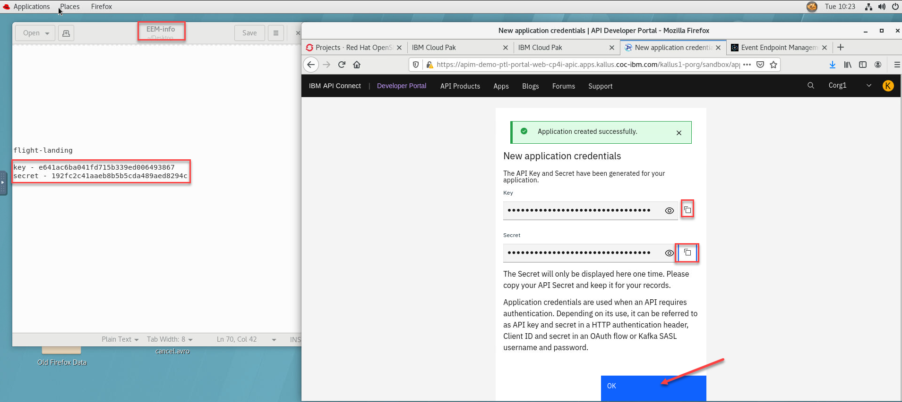

1. Now select **API Products** on the top menu bar and you will see all your products.   Click on your new AsyncAPIs product you created and published before.

    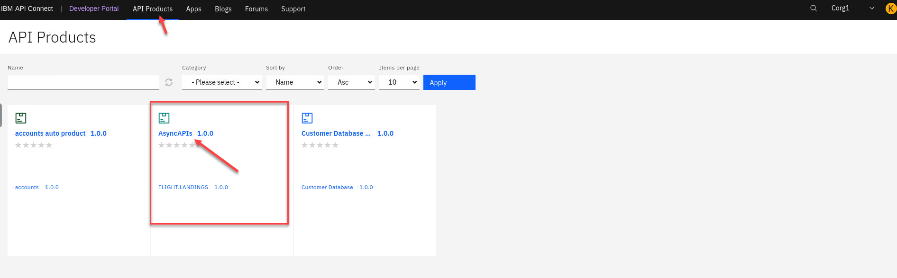

1. We need to select a plan to subscribe for this product.  We only have a **Default Plan** click on that.

    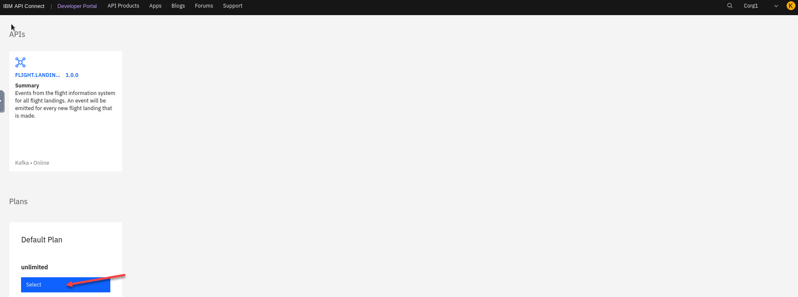

1. We now will select the app that we created to subscribe to this.

    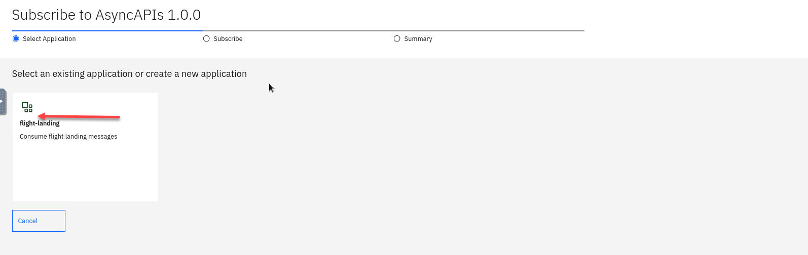

1. Review and Click **Next**

    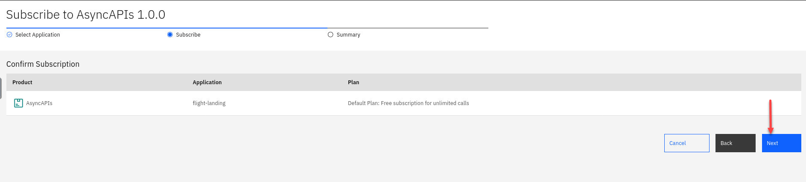

1. Review and Click **Done**

    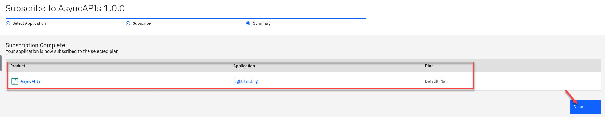

1. Now click on the AsyncAPI.

    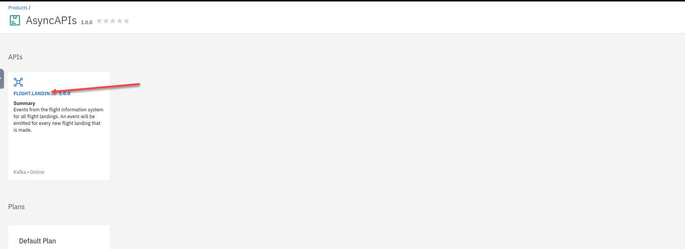

1. On the right side click on the Flight landing to open it up and select the subscribe operation.

    You will see Code snippet's for varies languages.   We will be using Java client and kafka-console-consumer to test the AsyncAPI.  

    **NOTE:**  Leave this tab open.  We will need it in the next lab.

    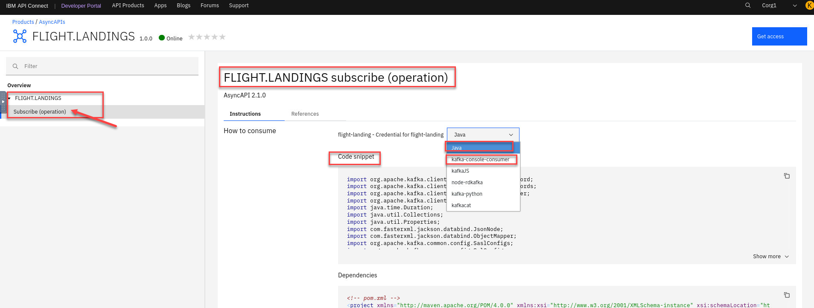

### ## RECAP
In this lab, you have explored the following key capabilities:

-    Access the Developer Portal and browse AsyncAPIs

-    Create an application and subscribe to a Plan to consume the AsyncAPI

[Return to main EEM lab page](../index.md#lab-abstracts)
