# AsyncApi - Consuming Flight Landing Events

In this lab, you will consume the flight landing events using Kafka Clients like kafka-console-consumer.sh and Java program.

# 1. Download the scripts to setup EEM clients

[Return to EEM lab page](../index.md)

<a name="download"></a>
## Download artifacts for EEM clients

You should be logged on your VDI as *student*.

1. Open a Firefox browser tab and navigate to [Github eemonCP4i](https://github.com/IBM-Automation-SPGI/eemoncp4i).

	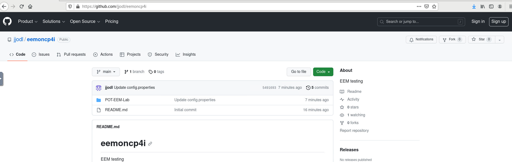

1. Click *Code* and select *Download zip*.

	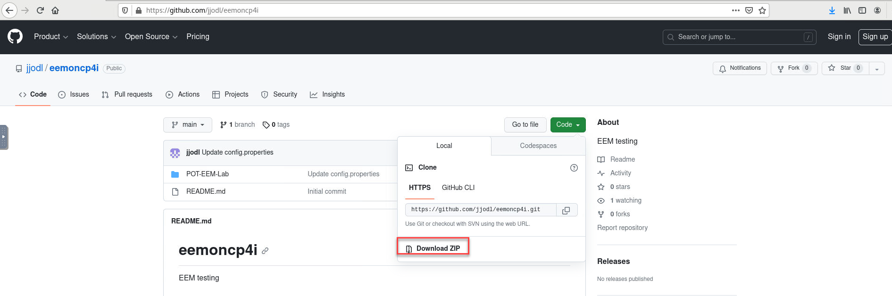

1. Click *Save file* radio button then click *OK*.

	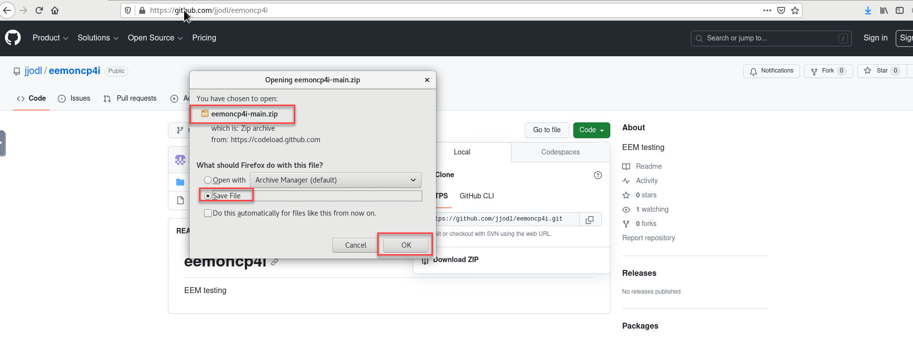

1. Open a terminal window by double-clicking the icon on the desktop.

	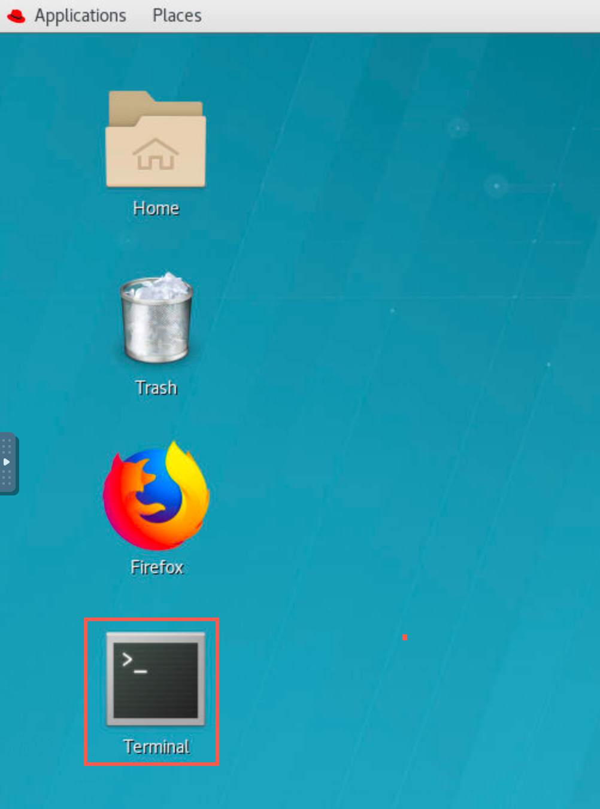

1. Enter the following command to see the zip file you just downloaded.

	```
	cd Downloads
	```

1. Enter the following command to unzip the downloaded file:

	```
	unzip eemoncp4i-main.zip
	```

	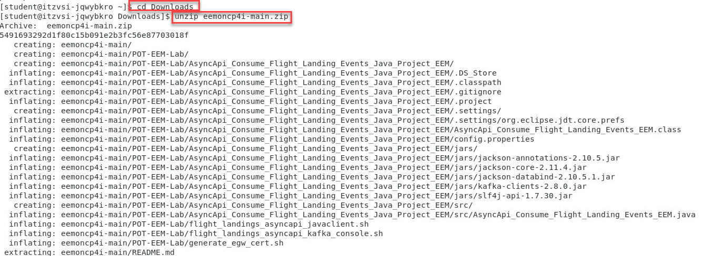

1. Move the unzipped directory to your home directory with the following command:

	```
	cd eemoncp4i-main
	```

	```
	mv POT-EEM-Lab/ ~/
	```

	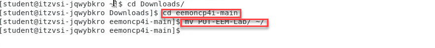

1. Now first we will need to change the mode to executable for all the scripts.   From the POT-EEM-Lab directory run the following commands.

	```
	cd ~/POT-EEM-Lab/
	```

	```
	find . -type f -iname "*.sh" -exec chmod +x {} \;
	```

	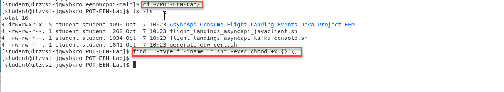


# 2. Obtain the Event gateway certs

Obtain Event Gateway bootstrap certificate, to be used by the Kafka Consumer clients. <br>
A set of files with Gateway Bootstrap certificate is already available and provided by instructor in the student resources folder.

1. Download the Gateway Bootstrap certificate files (*egw-cert.jks*,*egw-cert.p12*,*egw-cert.pem*) from the resources shared box folder

	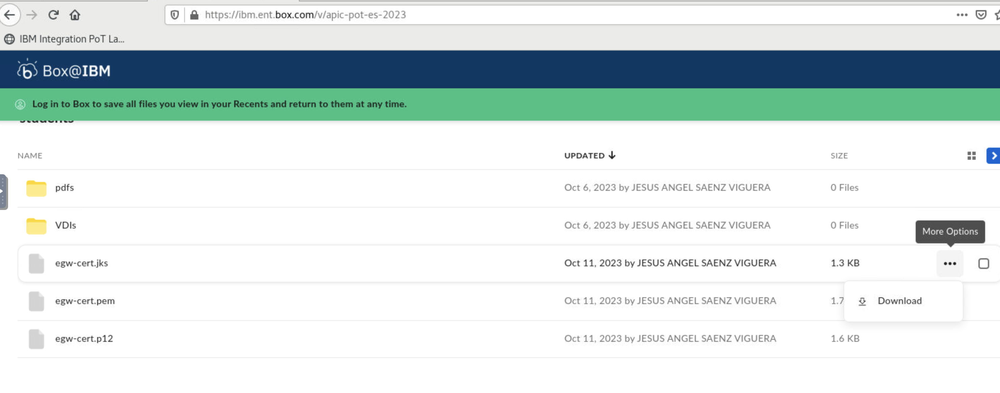

1. Move them to the local *~/POT-EEM-Lab/* directory. Use terminal window

	```
	mv ~/Downloads/egw-cert.* .
	```

1. Run **ls -l** in the terminal window and you should see your egw-certs

	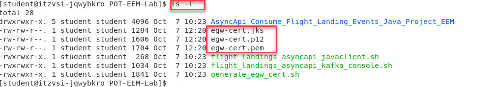

# 3. Consuming Flight Landing Events
## 3.1 kafka-console-consumer.sh

Receive flight landing events using open-source kafka-console-consumer.sh <br>
1. Now edit the flight_landings_asyncapi_kafka_console.sh. In the terminal window, run: **gedit flight_landings_asyncapi_kafka_console.sh &**

	```
	gedit flight_landings_asyncapi_kafka_console.sh &
	```

	You will see the editor open.  You only need to update the environment variables. Use the credentials of the *App* you registered in previous Lab using APIC Dev Portal for the *EGW_APIKEY* and *EGW_APISECRET* variables.

	The next steps will show you where to get the info for the other variables in the APIC Dev Portal.

	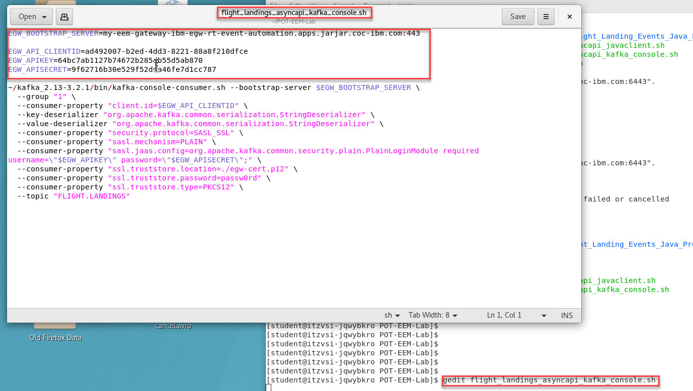

1. Login to your dev portal and you should see your AsyncAPI.  Click on that.

	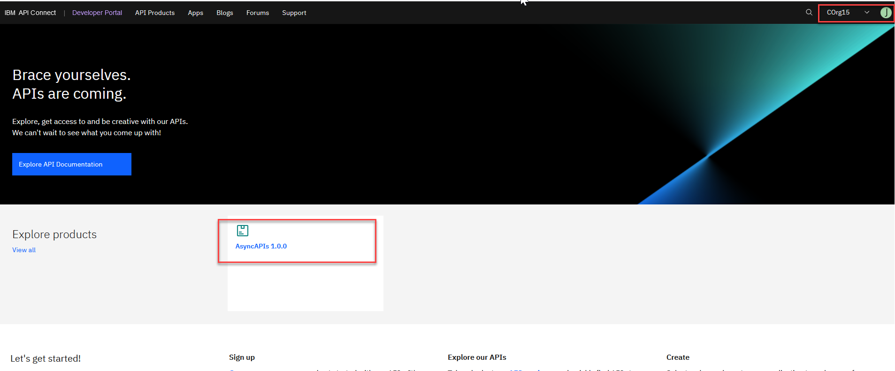

1. Click on the dropdown for flight landing and select the subscribe.  This will give you code snippets to get started.

	Select the kafka-console-consumer

	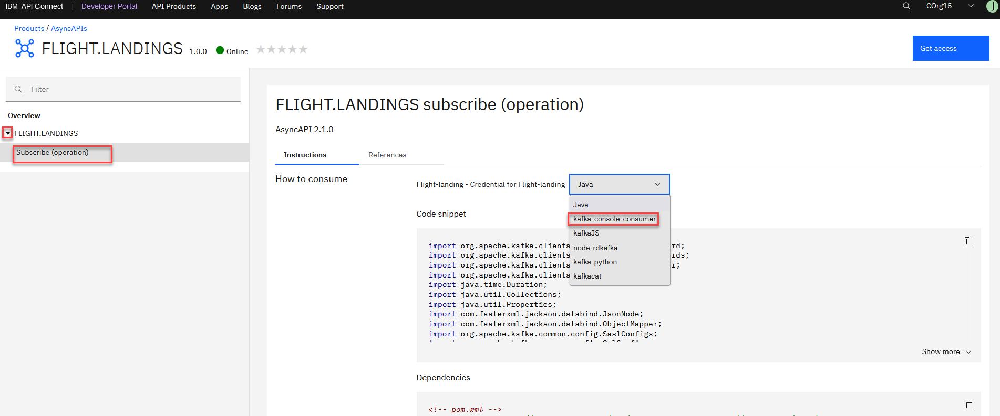

1. The window on the left is a notepad where you should have saved the key and secret when you created your application in the portal.

	In the code snippet you will see the two things you will also need.
	- bootstrap-server
	- client-id  

	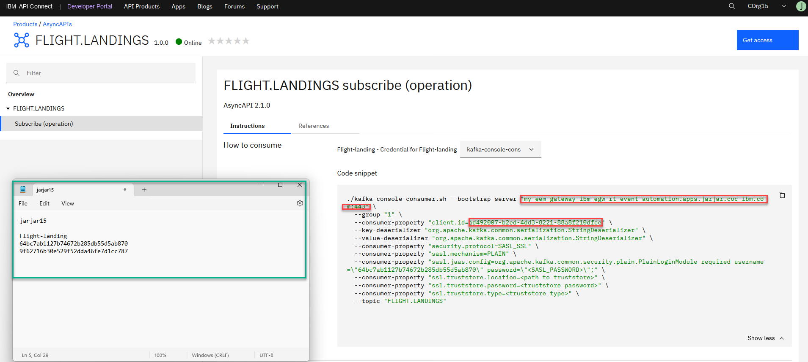

1. Go back to the gedit you open the script wit and replace the items.

	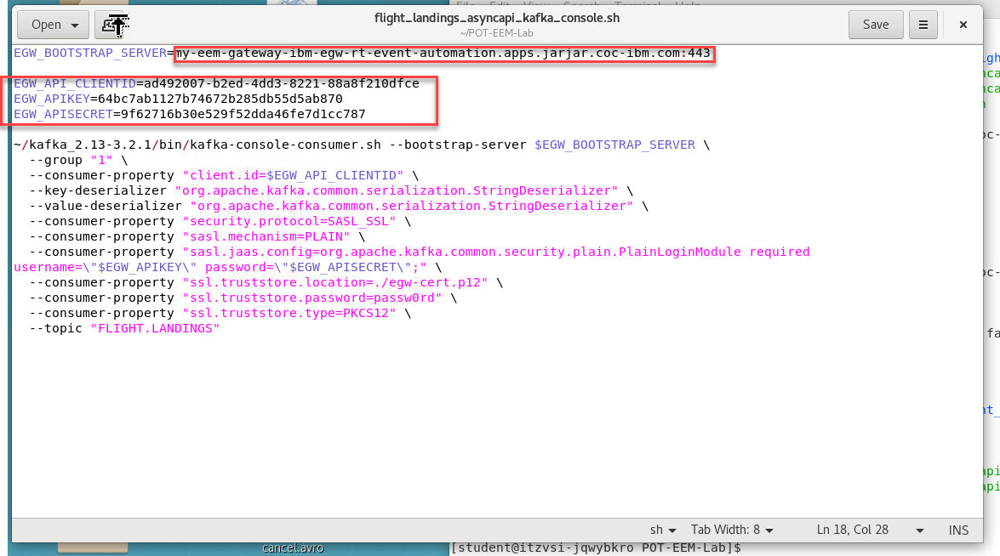

1. Also, change the set values of the following consumer properties
	```
	ssl.truststore.location=./egw-cert.jks
	ssl.truststore.type=JKS
	```

	Save changes.

	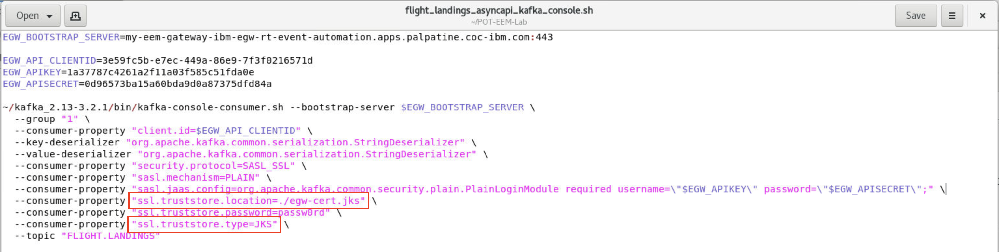

1. Now from the cmd terminal make sure you are in the POT-EM-Lab directory and run the flight_landings_asyncapi_kafka_console.sh

	```
	./flight_landings_asyncapi_kafka_console.sh
	```

	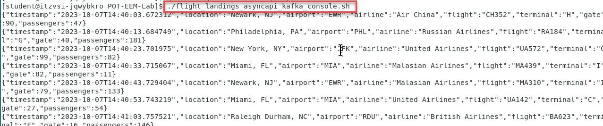

1. If the configurations are correct, then you should receive the flight landing events (at 10 seconds interval) being generated by the Flight landing Event Simulator App Connect Messa
	```
	{"timestamp":"2023-07-18T23:42:10.709400","location":"San Francisco, CA","airport":"SFO","airline":"American Airlines","flight":"AA911","terminal":"B","gate":35,"passengers":45}
	{"timestamp":"2023-07-18T23:42:20.721948","location":"San Francisco, CA","airport":"SFO","airline":"Russian Airlines","flight":"RA451","terminal":"G","gate":99,"passengers":34}
	```

	Stop the kafka_console script by entering *Crt+C*

## 3.2 Java Application

Use the Java Client application and receive the flight landing events thru the IBM Event Gateway --> Api Connect Async Api --> Event Streams, using a java client<br>

1. From the POT-EEM-Lab directory run the following command to get the config file for the java client.
	```
	 cd AsyncApi_Consume_Flight_Landing_Events_Java_Project_EEM/
	```
	Next edit the config properties file.
	```
	 gedit  config.properties &
	```
	You will see the same properties that you set for the kafka_console

	Update the variables in the script with the corresponding values and save it. Please don't forget to update also the property for the keystore file, as follows:
	```
	SslConfigs.SSL_TRUSTSTORE_LOCATION_CONFIG=/home/student/POT-EEM-Lab/egw-cert.jks
	```

	Also run ```cd ..``` to get back to right directory.

	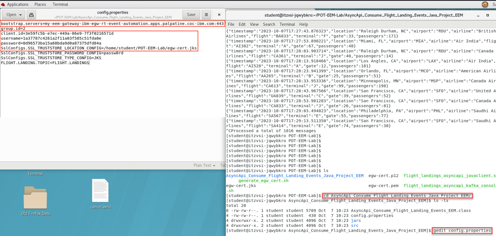

1. Now run the java client
	```
	./flight_landings_asyncapi_javaclient.sh
	```
	Watch the Flight Landing Events being received every 10 seconds

	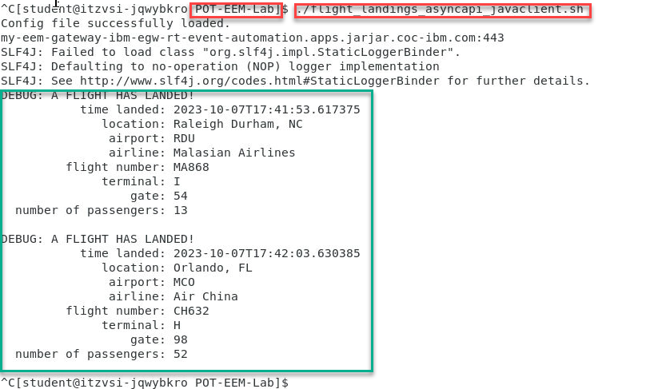


<b> END OF LAB </b>

[Return to EEM lab page](../index.md)
