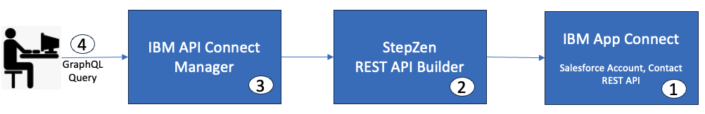
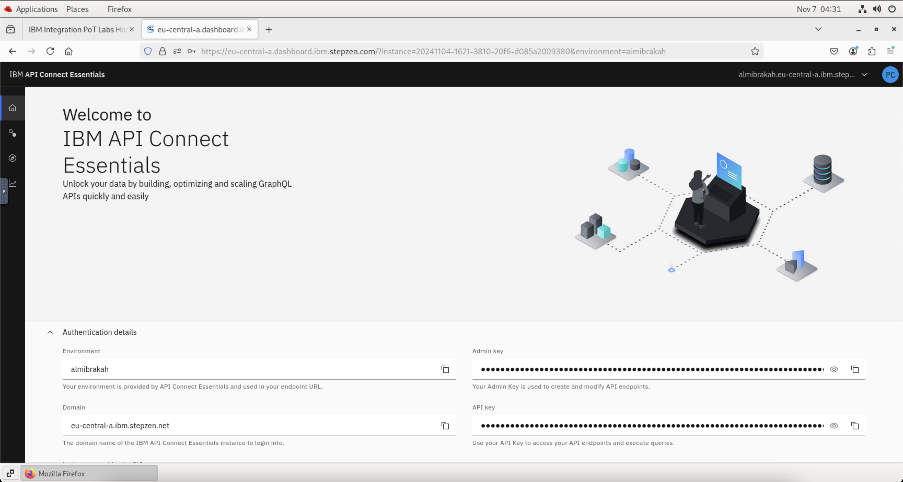
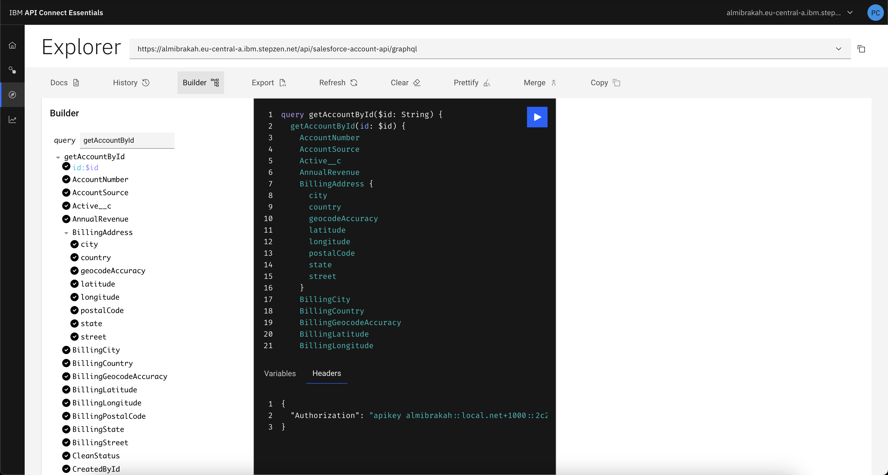
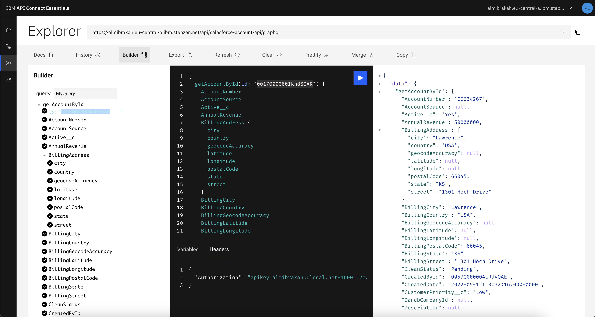

# IBM API Connect

## Creating a StepZen GraphQL Proxy for a Salesforce Account REST API

[Return to main APIC lab page](../README.md#lab-abstracts)

---

# Table of Contents
- [IBM API Connect](#ibm-api-connect)
  - [Creating a StepZen GraphQL Proxy for a Salesforce Account REST API](#creating-a-stepzen-graphql-proxy-for-a-salesforce-account-rest-api)
- [Table of Contents](#table-of-contents)
- [1. Introduction ](#1-introduction-)
- [2. StepZen ](#2-stepzen-)
  - [2a. StepZen CLI ](#2a-stepzen-cli-)
  - [2b. Import the Salesforce Account API Operations into the StepZen Configuration ](#2b-import-the-salesforce-account-api-operations-into-the-stepzen-configuration-)
  - [2c. Modify index.graphql Files ](#2c-modify-indexgraphql-files-)
- [3. Deploy to the StepZen Server ](#3-deploy-to-the-stepzen-server-)
- [4. Working with the StepZen Dashboard ](#4-working-with-the-stepzen-dashboard-)
  - [3a. StepZen GraphQL Query Testing ](#3a-stepzen-graphql-query-testing-)
  - [4b. Capturing the salesforce-account-api GraphQL Server URL ](#4b-capturing-the-salesforce-account-api-graphql-server-url-)
- [5. Creating the GraphQL API in API Connect ](#5-creating-the-graphql-api-in-api-connect-)
  - [5a. Testing the GraphQL API from the API Connect Manager ](#5a-testing-the-graphql-api-from-the-api-connect-manager-)
- [6. Summary ](#6-summary-)

---

# 1. Introduction <a name="introduction"></a>

In this lab, we will leverage an existing REST API to create StepZen GraphQL Proxy and then expose the GraphQL Proxy through IBM API Connect. For the lab, we will be leveraging a Salesforce Account REST API deployed onto IBM App Connect. A Salesforce Account Object has 100+ fields. By using GraphQL, one can Query for fields that they are interested in thus reducing the response payload and network traffic.



-	Create StepZen Configurations for both methods
-	Capture REST API Endpoints for getAccounts, getAccount methods
-	Deploy to StepZen GraphQL Server
-	Test the GraphQL Queries in StepZen Portal
-	Extract StepZen GraphQL URL from StepZen Portal
-	Expose GraphQL URL into IBM API Connect
-	Test GraphQL API from API Connect

# 2. StepZen <a name="stepzen"></a>

## 2a. StepZen CLI <a name="stepzen_cli"></a>

1\. If you have been using a browser outside of the VDI, navigate to the browser tab where the Cloud Pak for Integration VDI is running.


2\. From within the VDI, launch **Firefox**.


3\. Navigate to stepzen.com and click **Log In**.


4\. Enter the **Username** and **Password** provided by your instructor and click **LOG IN**.


5\. Go to the **Dashboard** and navigate to the **Account** tab.



6\. Copy and paste the **Account** and **Admin Key** into a text editor.


7\. From within the VDI, launch **Terminal**.


8\. In the terminal, log in with the Account that you copied in the step above.

```
stepzen login -a <account>
```
Make sure you replace **\<account\>** with the **Account** you copied in the previous step.


9\. When prompted, enter the **admin key** that you copied in the previous step.


## 2b. Import the Salesforce Account API Operations into the StepZen Configuration <a name="stepzen_import"></a>

Next, you will be importing the getAccount and getAccounts operations into StepZen.

1\. Using the terminal, create a directory called **stepzen-salesforce-account-api**.

```
mkdir stepzen-salesforce-account-api
```


2\. Change into the **stepzen-salesforce-account-api** directory.

```
cd stepzen-salesforce-account-api
```


3\. Copy the below 5 lines as-is, and paste in the command line. This will create config.yaml.

```
echo "access:
  policies:
    - type: Query
      policyDefault:
        condition: true" > config.yaml
```


4\. Next you will import the Get Salesforce Account by ID operation.  In the terminal, enter:

```
stepzen import curl "<REPLACE-WITH-GETACCOUNT-URL>"
```

Replace **\<REPLACE-WITH-GETACCOUNT-URL\>** with the value for the *getAccount* endpoint provided by the instructor within the parameters file . This is the REST endpoint of the existing Salesforce service.


5\. Enter **api/salesforce-account-api** when prompted for what you want your endpoint to be called.


6\. Next you will import the Get Salesforce Accounts operation.  In the terminal, enter:

```
stepzen import curl "<REPLACE-WITH-GETACCOUNTS-URL>"
```

Replace **\<REPLACE-WITH-GETACCOUNTS-URL\>** with the value for the *getAccounts* endpoint provided by the instructor within the parameters file. This is the REST endpoint of the existing Salesforce service.


For example:


## 2c. Modify index.graphql Files <a name="modify"></a>

Next, you will modify the index.graphql files.

1\. From the **Terminal** in the VDI, enter:

```
gedit curl/index.graphql
```

2\. The Text Editor will be opened. Jump to the last line of the file.


3\.  Replace **myQuery** with **getAccountById**. 


4\. Save the file and close the Text Editor.

5\. From the **Terminal** in the VDI, enter:

```
gedit curl-01/index.graphql
```

6\. Jump to the last line of the file.


7\.  Replace **myQuery** with **getAccounts**. 


8\. Next, we need to remove the **Attributes**, **BillingAddress**, and **ShipingAddress** types as they are duplicate segments under curl and curl-01.


The file should now begin with **RootEntry**.


9\. Save the file and close the Text Editor.

# 3. Deploy to the StepZen Server <a name="deploy"></a>

In this section, you will deploy the salesforce-account-api to the StepZen server.

1\. In the terminal, make sure that you are in the **stepzen-salesforce-account-api** directory and enter ``stepzen start``.


This will deploy the GraphQL Queries into the StepZen account.


# 4. Working with the StepZen Dashboard <a name="stepzen_dashboard"></a>

1\. Copy the URL (https://dashboard.stepzen.com/explorer?endpoint=api%2Fsalesforce-account-api) found under **Or explore it with GraphiQL at** and paste it into a new browser window.


## 3a. StepZen GraphQL Query Testing <a name="stepzen_testing"></a>

From the StepZen Dashboard, you will be testing both the queries.

1\. You will first run the getAccounts query will all of the fields.  You should see the getAccounts query already reflected in the Explorer.



If you do not, you can cut and paste the query below.

```
 query getAccounts {
  getAccounts {
    AccountNumber
        AccountSource
        Active__c
        AnnualRevenue
        BillingAddress{
            city
            country
            geocodeAccuracy
            latitude
            longitude
            postalCode
            state
            street
        }
        BillingCity
        BillingCountry
        BillingGeocodeAccuracy
        BillingLatitude
        BillingLongitude
        BillingPostalCode
        BillingState
        BillingStreet
        CleanStatus
        CreatedById
        CreatedDate
        CustomerPriority__c
        DandbCompanyId
        Description
        DunsNumber
        Fax
        Id
        Industry
        IsDeleted
        Jigsaw
        JigsawCompanyId
        LastActivityDate
        LastModifiedById
        LastModifiedDate
        LastReferencedDate
        LastViewedDate
        MasterRecordId
        NaicsCode
        NaicsDesc
        Name
        NumberOfEmployees
        NumberofLocations__c
        OwnerId
        Ownership
        ParentId
        Phone
        PhotoUrl
        Rating
        SLAExpirationDate__c
        SLASerialNumber__c
        SLA__c
        ShippingAddress {
          city
          country
          geocodeAccuracy
          latitude
          longitude
          postalCode
          state
          street
        }
        ShippingCity
        ShippingCountry
        ShippingGeocodeAccuracy
        ShippingLatitude
        ShippingLongitude
        ShippingPostalCode
        ShippingState
        ShippingStreet
        Sic
        SicDesc
        Site
        SystemModstamp
        TickerSymbol
        Tradestyle
        Type
        UpsellOpportunity__c
        Website
        YearStarted
        attributes{
            type
            url
        }
        nextPageToken
  }
}

```

2\. To execute the query, click on the **Execute query** button.


Results (**Note:**  The data in your results may be different):


3\. Next, you will run getAccounts with a smaller set of fields.  In the Explorer, click on **Clear**.


4\. Copy and paste the query below into the Explorer and click **Execute query**.

```
query getAccounts {
  getAccounts {
    Id
    AccountNumber
    Name
    AnnualRevenue
    BillingAddress {
      city
      country
      postalCode
      state
      street
    }
  }
}
```


Results:


5\. Capture one of the **Id** values from the output (e.g., 0014100000D0bbQAAR).  You will use this Id to test getAccountById query.


6\. Next, you will run getAccountById with all of the fields.  In the Explorer, click on **Clear**.


7\. Copy and paste the query below into the Explorer.  Make sure that you change the **id** to the **Id** that you copied in Step #5 and click **Execute query**.

```
{
    getAccountById(id: "0017Q00000Ikh8SQAR"){
        AccountNumber
        AccountSource
        Active__c
        AnnualRevenue
        BillingAddress{
            city
            country
            geocodeAccuracy
            latitude
            longitude
            postalCode
            state
            street
        }
        BillingCity
        BillingCountry
        BillingGeocodeAccuracy
        BillingLatitude
        BillingLongitude
        BillingPostalCode
        BillingState
        BillingStreet
        CleanStatus
        CreatedById
        CreatedDate
        CustomerPriority__c
        DandbCompanyId
        Description
        DunsNumber
        Fax
        Id
        Industry
        IsDeleted
        Jigsaw
        JigsawCompanyId
        LastActivityDate
        LastModifiedById
        LastModifiedDate
        LastReferencedDate
        LastViewedDate
        MasterRecordId
        NaicsCode
        NaicsDesc
        Name
        NumberOfEmployees
        NumberofLocations__c
        OwnerId
        Ownership
        ParentId
        Phone
        PhotoUrl
        Rating
        SLAExpirationDate__c
        SLASerialNumber__c
        SLA__c
        ShippingAddress
        ShippingCity
        ShippingCountry
        ShippingGeocodeAccuracy
        ShippingLatitude
        ShippingLongitude
        ShippingPostalCode
        ShippingState
        ShippingStreet
        Sic
        SicDesc
        Site
        SystemModstamp
        TickerSymbol
        Tradestyle
        Type
        UpsellOpportunity__c
        Website
        YearStarted
        attributes{
            type
            url
        }
        nextPageToken
    }
}
```


Result:


8\. Next, you will run getAccounts with a smaller set of fields.  In the Explorer, click on **Clear**.


9\. Copy and paste the query below into the Explorer.  Make sure that you change the **id** to the **Id** that you copied in Step #5 and click **Execute query**.

```
{
  getAccountById(id: "0017Q00000Ikh8SQAR") {
    Id
    AccountNumber
    Name
    AnnualRevenue
    BillingAddress {
      city
      country
      postalCode
      state
      street
    }
  }
}
```


Result:


10\. Lastly, you will run multiple queries together. In the Explorer, click on **Clear**.


11\. Copy and paste the query below into the Explorer.  Make sure that you change the **id** to the **Id** that you copied in Step #5 and click **Execute query**.  

```
query MyQuery {
  getAccountById(id: "0017Q00000Ikh8SQAR") {
    Id
    AccountNumber
    Name
    AnnualRevenue
    BillingAddress {
      city
      country
      postalCode
      state
      street
    }
  }
  getAccounts {
    Id
    AccountNumber
    Name
    AnnualRevenue
    BillingAddress {
      city
      country
      postalCode
      state
      street
    }
  }
}
```


Result:


## 4b. Capturing the salesforce-account-api GraphQL Server URL <a name="capture"></a>

1\. Copy the StepZen GraphQL Server URL and save it to a text editor. You will use this URL in the following section to create GraphQL API Proxy in API Connect.


# 5. Creating the GraphQL API in API Connect <a name="graphql_apic"></a>

1\. If you are not already logged into the Platform Navigator, enter the URL for the Platform Navigator that was provided by your instructor.  To navigate to the main page of the Platform Navigator, click on **IBM Cloud Pak** in the upper left.


2\. Navigate to the API Connect instance.


3\. If you are asked to log in, click **Common Services User Registry**.


4\. Once logged in, confirm that you are in the organization for your user and click **Develop APIs and products**.


5\. With the **APIs** tab selected, click **Add** and then select **API (from REST, GraphQL or SOAP)**.


6\. Select **From existing GraphQL service (GraphQL proxy)** and click **Next**.


7\. For the **Title**, enter **stepzen-graphql-salesforce-account-api** and for the **GraphQL Server URL** paste the URL that you copied in the previous section.


8\. Accept the defaults and click **Next**.


9\. Make sure that **Activate API** is not selected and click **Next**.


10\. Upon reviewing the Summary, click **Edit API**.


11\. Navigate to the **Gateway** tab.


12\. Select the **graphql-invoke** action (middle of the flow) which can be found under **GraphQL execute** (under **Otherwise**).


13\. Make sure that **Compression** flag is not selected.


14\. Click **Save**.


15\. Once saved, you will see an indicator window appear that shows that **Your API has been updated**. Click on the **X** to close the window.


## 5a. Testing the GraphQL API from the API Connect Manager <a name="testing_apim"></a>

In the API Designer, you have the ability to test the API.

1\. Switch the toggle from Offline to Online. This step automatically publishes the API.


2\. You will see an indicator window appear that shows that **Your API has been updated**. Click on the **X** to close the window. You should see that the API is now Online.


3\. Click on the Test tab.


4\. From the drop down menu, select the **POST** operation that ends with **stepzen-graphql-salesforce-account-api/graphql**.


5\. In **GraphiQL**, put you cursor in the request area and enter (**CTRL + A**) and hit the **delete** key.


6\. Copy and paste the **getAccounts** query below into **GraphiQL** and click **Execute Query**.

```
query getAccounts {
  getAccounts {
    Id
    AccountNumber
    Name
    AnnualRevenue
    BillingAddress {
      city
      country
      postalCode
      state
      street
    }
  }
}
```


Result:


7\. Capture one of the **Id** values from the output (e.g., 0014100000D0bbQAAR).  You will use this Id to test getAccountById query.

8\. In **GraphiQL**, put you cursor in the request area and enter (**CTRL + A**) and hit the **delete** key.

9\. Copy and paste the **getAccounts** query below into **GraphiQL**.  Make sure that you change the **Id** to the **Id** that you copied in Step #7 and click **Execute Query**.

```
{
  getAccountById(id: "0017Q00000Ikh8SQAR") {
    Id
    AccountNumber
    Name
    AnnualRevenue
    BillingAddress {
      city
      country
      postalCode
      state
      street
    }
  }
}
```


Result:


10\. In **GraphiQL**, put you cursor in the request area and enter (**CTRL + A**) and hit the **delete** key.

11\. Copy and paste the query below into the Explorer.  Make sure that you change the **id** to the **Id** that you copied in Step #7 and click **Execute Query**.

```
query MyQuery {
  getAccountById(id: "0017Q00000Ikh8SQAR") {
    Id
    AccountNumber
    Name
    AnnualRevenue
    BillingAddress {
      city
      country
      postalCode
      state
      street
    }
  }
  getAccounts {
    Id
    AccountNumber
    Name
    AnnualRevenue
    BillingAddress {
      city
      country
      postalCode
      state
      street
    }
  }
}
```


Result:


# 6. Summary <a name="summary"></a>

Congratulations, you have completed the **Creating a StepZen GraphQL Proxy for a Salesforce Account REST API** lab.  Throughout the lab, you learned how to:

-	Create StepZen Configurations for both methods
-	Capture REST API Endpoints for getAccounts, getAccount methods
-	Deploy to StepZen GraphQL Server
-	Test the GraphQL Queries in StepZen Portal
-	Extract StepZen GraphQL URL from StepZen Portal
-	Expose GraphQL URL into IBM API Connect
-	Test GraphQL API from API Connect

[Return to main APIC lab page](../README.md#lab-abstracts)
